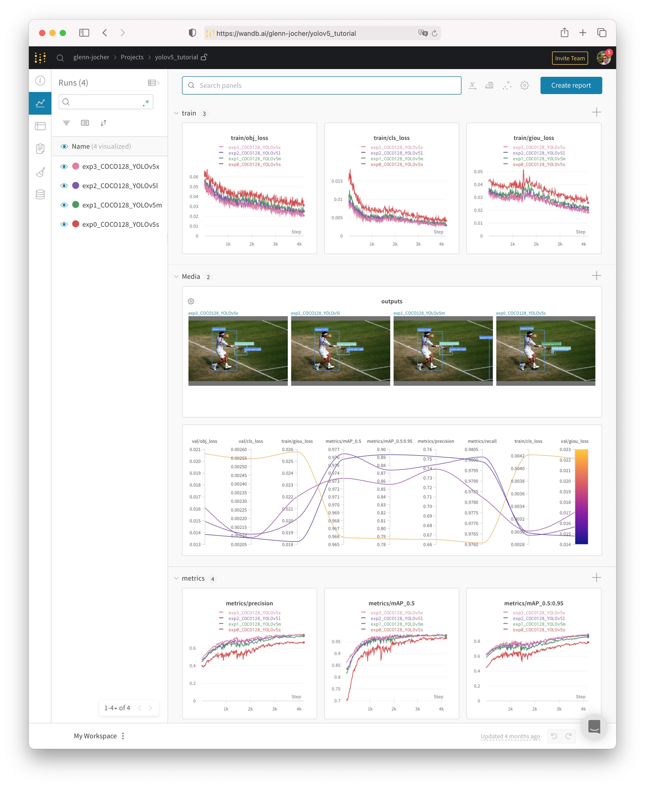

(yolo:tutorials:train-custom-datasets)=
# 自定义数据 📌

📚本指南解释了如何使用YOLOv5🚀训练自定义数据集。

## 训练

设置训练配置。

### 创建 `dataset.yaml`

[COCO128](https://www.kaggle.com/ultralytics/coco128) 是一个小型教程数据集，由 [COCO](http://cocodataset.org/#home) train2017 中的前 128 张图像组成。这些相同的 128 幅图像用于训练和验证，以验证我们的训练管道能够过拟合。[`data/coco128.yaml`](https://github.com/ultralytics/yolov5/blob/master/data/coco128.yaml) 是数据集配置文件它定义了：

1. 可选下载命令/ 自动下载的 URL；
2. 训练图像路的目录（或训练图片路径列表的 `*.txt` 文件）；
3. 验证图片的目录（或验证图片路径列表的 `*.txt` 文件）；
4. 类的数量；
5. 类名称的列表

```{literalinclude} ./opts/coco128.yml
:language: yaml
```

### 创建标签

在使用  [CVAT](https://github.com/opencv/cvat)、[makesense.ai](https://www.makesense.ai/) 或者 [Labelbox](https://labelbox.com/) 标注你的图片，输出你的标签为 **YOLO 格式**，每幅图像一个 `*.txt` 文件（如果图像中没有对象，则不需要 `*.txt` 文件）。`*.txt` 文件规格如下:

- 每个对象一行
- 每一行都是 `class x_center y_center width height` 格式。
- 边框坐标必须是 **归一化的 `xywh`** 格式（从 0 到 1）。如果框以像素为单位，则将 `x_center` 和 `width` 除以图像宽度，`y_center`和 `height` 除以图像高度。
- 类号是零索引的（从 0 开始)）。


上图所对应的标签文件包含 2 个人（类 `0`）和一条领带（类 `27`）：


### 组织目录

根据下面的示例组织您的 `train` 和 `val` 图像和标签。在本例中，我们假设 `/coco128` 位于 `/yolov5` 目录旁边。`YOLOv5` 通过将每个图像路径中的最后一个 `/images/` 实例替换为 `/labels/` 来自动定位每个图像的标签。例如：

```shell
dataset/images/im0.jpg  # image
dataset/labels/im0.txt  # label
```


### 选择一个模型

选择一个预先训练的模型来开始训练。这里选择 [YOLOv5s](https://github.com/ultralytics/yolov5/blob/master/models/yolov5s.yaml)，最小和最快的可用模型。


### 训练

在 COCO128 上训练 YOLOv5s 模型，指定数据集、批大小、图像大小，或者预训练的 `--weights yolov5s.pt`（推荐），或者随机初始化 `--weights '' --cfg yolov5s.yaml`（不推荐）。预训练的权重可以从[最新的YOLOv5 版本](https://github.com/ultralytics/yolov5/releases)中自动下载。

```shell
# Train YOLOv5s on COCO128 for 5 epochs
$ python train.py --img 640 --batch 16 --epochs 5 --data coco128.yaml --weights yolov5s.pt
```

所有的训练结果都保存到 `runs/train/`，运行目录是递增的，例如：`runs/train/exp2`, `runs/train/exp3` 等。要了解更多细节，请参阅我们谷歌 Colab 笔记本的训练部分。[](https://colab.research.google.com/github/ultralytics/yolov5/blob/master/tutorial.ipynb) [](https://www.kaggle.com/ultralytics/yolov5)

## 可视化

### 权重和偏差日志

[Weight & Bias](https://wandb.ai/site?utm_campaign=repo_yolo_traintutorial)（W&B）现在与 YOLOv5 集成，用于训练运行的实时可视化和云记录。这允许更好的运行比较和内省，以及改进团队成员之间的可见性和协作。要启用 W&B 日志，请安装 `wandb`，然后进行正常训练（您将在第一次使用时得到指导）。

```shell
$ pip install wandb
```

在训练期间，您将在 <https://wandb.ai> 上看到实时更新，您可以使用 W&B 报告工具创建结果的[详细报告](https://wandb.ai/glenn-jocher/yolov5_tutorial/reports/YOLOv5-COCO128-Tutorial-Results--VmlldzozMDI5OTY)。



### 本地日志

默认情况下，所有结果都被记录到 `runs/train`，为每个新的训练创建一个新的实验目录，如 `runs/train/exp2`、`runs/train/exp3` 等。查看训练和测试 jpgs 可以看到马赛克（mosaics），标签，预测和增强效果。注意，马赛克数据加载器（**Mosaic Dataloader**）用于训练（如下所示），一个由 Ultralytics 首次在 [YOLOv4](https://arxiv.org/abs/2004.10934) 开发的新概念。

`train_batch0.jpg` 显示训练批次 0 的马赛克和标签：


`test_batch0_labels.jpg` 显示测试批次 0 标签：


`test_batch0_pred.jpg` 显示测试批 0 的预测：


训练损失和性能指标也被记录到 [Tensorboard](https://www.tensorflow.org/tensorboard) 和一个定制的 `results.txt` 日志文件中，该日志文件在训练完成后绘制为 `results.png`（下图）。在这里，我们展示了训练过 COCO128 到 300 个 epoch 的 YOLOv5s，从头开始（蓝色），以及预训练 `--weights yolov5s.pt`（橙色）。

```shell
from utils.plots import plot_results 
plot_results(save_dir='runs/train/exp')  # plot results.txt as results.png
```


## 环境

YOLOv5 可以在以下任何一个最新验证环境中运行（所有依赖项包括 [CUDA](https://developer.nvidia.com/cuda)/[CUDNN](https://developer.nvidia.com/cudnn), [Python](https://www.python.org/) 和 [PyTorch](https://pytorch.org/) 预安装）：

- [谷歌 Colab](https://colab.research.google.com/github/ultralytics/yolov5/blob/master/tutorial.ipynb) 和 [Kaggle 笔记本](https://www.kaggle.com/ultralytics/yolov5)与免费 GPU
- 谷歌云深度学习虚拟机。见 [GCP 快速入门指南](https://github.com/ultralytics/yolov5/wiki/GCP-Quickstart)
- 亚马逊深度学习AMI。见 [AWS 快速入门指南](https://github.com/ultralytics/yolov5/wiki/AWS-Quickstart)
- Docker Image。见 [Docker 快速入门指南](https://github.com/ultralytics/yolov5/wiki/Docker-Quickstart) [](https://hub.docker.com/r/ultralytics/yolov5)

## 状态


如果此标识为绿色，则当前通过了所有 [YOLOv5 GitHub Actions](https://github.com/ultralytics/yolov5/actions) Continuous Integration（CI）测试。CI 测试在 MacOS、Windows 和 Ubuntu 上每 24 小时和每次提交时验证 YOLOv5 训练（[`train.py`](https://github.com/ultralytics/yolov5/blob/master/train.py)）、测试（[`test.py`](https://github.com/ultralytics/yolov5/blob/master/test.py)）、推断（[`detect.py`](https://github.com/ultralytics/yolov5/blob/master/detect.py)）和导出（[`export.py`](https://github.com/ultralytics/yolov5/blob/master/models/export.py)）的正确操作。
